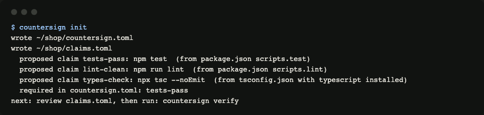
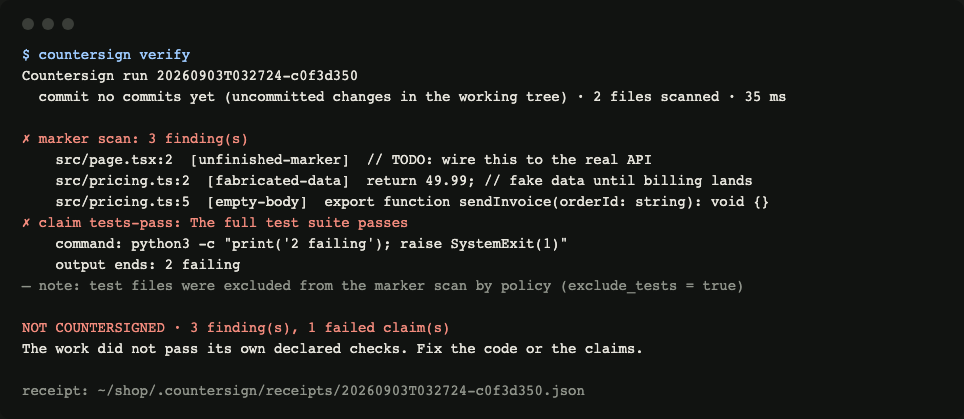
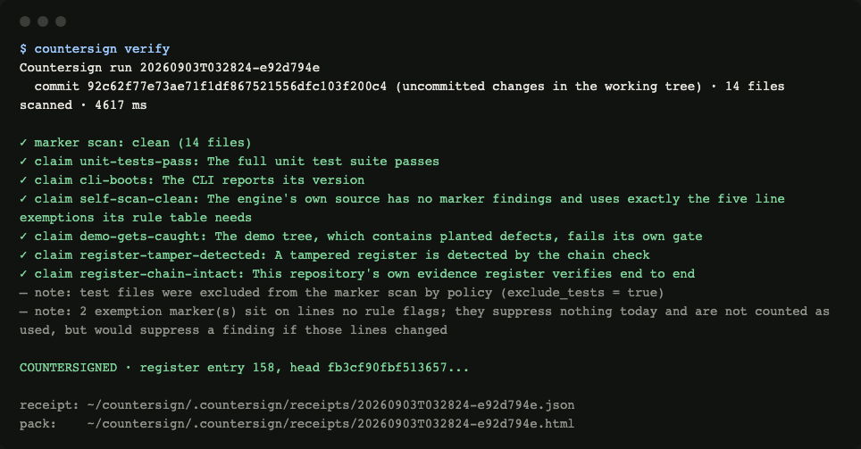
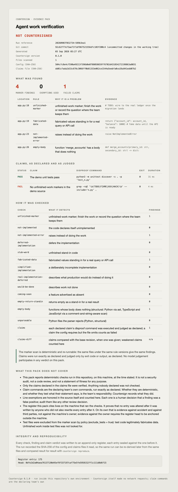
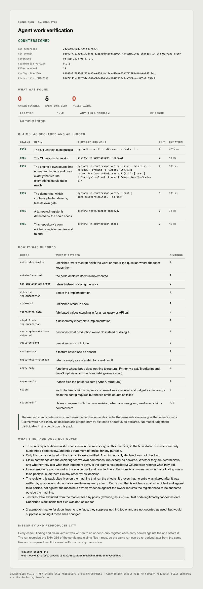
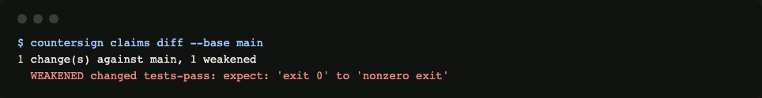
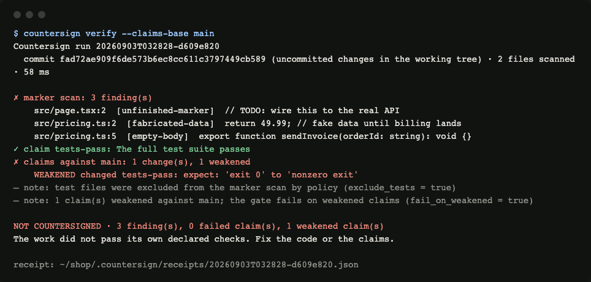
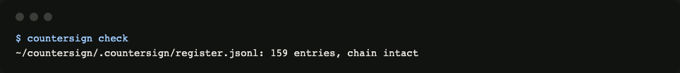
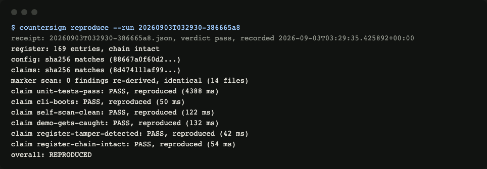

<!-- audited on 20260903 -->
# Countersign user guide

Countersign makes an agent's "done" a testable statement. You declare what is true about a repository, each claim with the command that would fail if it were false. Countersign scans the code for unfinished work, runs every disproof command, and writes a receipt that says exactly what was checked, what was found, and what was not covered.

Everything on this page was produced by the commands shown, on a small TypeScript shop repository and on Countersign's own repository.

## 1. Install

```bash
pip install countersign-cli
```

Python 3.11 or newer. No other dependency, ever. If installing is not an option, run it from a checkout:

```bash
PYTHONPATH=/path/to/countersign python3 -m countersign verify
```

## 2. Initialise a repository

`countersign init` writes `countersign.toml` and a starter `claims.toml`. It reads the build files that are actually there and proposes the stack's own commands. Here it found a `test` and a `lint` script in package.json and a tsconfig with TypeScript installed:



Nothing is guessed. A repository with no recognised build files gets a commented example to edit. The `tests-pass` claim is marked as required in the config, which means deleting it later fails the gate.

Open `claims.toml` and make the commands yours. A claim looks like this:

```toml
[[claim]]
id = "tests-pass"
statement = "The full test suite passes"
command = "npm test"
expect = "exit 0"
```

Three expectations exist: `exit 0` (the default), `nonzero exit` (for negative tests, "this must fail"), and `output contains` with a `needle`. Commands run through your shell, from the repository root, with your privileges. Review changes to `claims.toml` the way you review changes to CI configuration.

Then narrow `paths` in `countersign.toml` to production source. The marker rules were tuned on a tree whose gate covered `src/`, the dashboard and the clients, not seed scripts, migrations or docs: a seed script that says "sample data" is describing demo data, not faking a query.

```toml
[scan]
paths = ["src", "dashboard/src"]
```

## 3. Verify

`countersign verify` runs the marker scan and every claim, appends everything to the register, and writes a receipt and an evidence pack. On the shop repository the agent left a TODO, a fake price and an empty function, and the tests fail:



Each finding names the file, the line, the rule and the offending line. Each failed claim shows its command and the last line of its output. The verdict line counts findings and failed claims. Exit code 1.

When the work passes its own declared checks, the run is countersigned. This is Countersign's own repository verifying itself:



Notice what the receipt says without being asked: that the working tree had uncommitted changes, that test files were excluded by policy, and that two exemption markers sit on lines no rule flags. A skipped check is always printed as skipped, never folded into a pass.

## 4. The evidence pack

Every run writes a single HTML file under `.countersign/receipts/` that opens anywhere and prints to PDF. It is the thing you hand to someone else: what was checked, how, what was found, and what was not covered.



The same pack for a passing run:



The "What this pack does not cover" section is not boilerplate. It states, in this order, that the checks are deterministic and nothing more, that only declared claims were verified, that claim commands are the declaring team's own, how exemptions work, and exactly what the register does and does not prove.

## 5. Who guards the claims

The agent that wrote the code can also write the claims. The quiet way past a gate is not to fix the code but to soften the claim. Countersign names every such change.

**Required claims.** In `countersign.toml`:

```toml
[claims]
required = ["tests-pass"]
```

A required claim that is not declared is recorded as `MISSING` and fails the gate.

**Claims diff.** Compare the claims file with any git revision:



A removed claim, a changed expectation or a changed needle is a weakening. A changed command is listed for the reviewer, because the engine cannot know whether `npm test` became stricter or looser.

Give `verify` the base revision and the diff becomes part of the run, the receipt and the pack. A weakened claim fails the gate unless the config sets `fail_on_weakened = false`, in which case it is recorded and the run says so:



The GitHub action does this on every pull request against the pull request's base branch.

## 6. The register

Every check, finding and claim verdict is one line of JSON in `.countersign/register.jsonl`. Each line carries the SHA-256 of the line before it. `countersign check` recomputes the whole chain:



Edit any earlier line and the check names the entry that no longer follows. Appends are locked, so two runs on one checkout cannot break the chain by racing.

What the register proves, exactly: that no entry was altered after it was written by anyone who did not also rewrite every entry after it. It lives on the machine that ran the checks, so on its own it is evidence against accident and against third parties, not against the machine's owner. Evidence against the owner requires the register head to be anchored outside the machine.

## 7. Reproduce a run

`countersign reproduce --run <id>` takes a receipt, confirms the config and claims files are byte for byte the ones the run read, re-runs the scan and every claim, and compares result for result:



If the files changed, you are told which. If the findings differ, you are told which. Claims that touch the outside world may legitimately diverge over time; each divergence is reported, not excused.

## 8. Continuous integration

If the repository's origin is on github.com, `countersign init` already wrote `.github/workflows/countersign.yml` for you (it says so in its output; `--no-github` skips it, `--github` insists). Commit and push it. Otherwise, add this step to a workflow of your own:

```yaml
- uses: gaigenticai/countersign@v0.1
  with:
    config: countersign.toml      # default
    fail-on: fail                 # or warn: record the verdict without failing
    receipts-dir: .countersign    # must match [receipts] dir in the config
```

The action runs Countersign straight from its checkout, with no pip install and nothing fetched from PyPI. The Markdown summary lands in the job step summary, receipts and packs upload as a `countersign-receipts` artifact, and on pull requests the claims file is diffed against the base branch.

## 9. Exemptions

A genuine false positive is exempted in the source itself, on the line:

```python
label = "Coming soon"  # countersign: exempt
```

Every exemption that suppressed a finding is counted on the receipt. A marker that suppresses nothing is reported as inert, so a stale one cannot hide. Exemptions live in the file where a reviewer sees them, never in a config.

## 10. Configuration reference

`countersign.toml`, every key with its default:

```toml
[scan]
paths = ["."]                      # relative to this file; a missing path is an error
ignore_dirs = [".git", "node_modules", "__pycache__", ".venv", "dist", "build", "..."]
extensions = [".py", ".ts", ".tsx", ".js", ".jsx", ".mjs", ".cjs", ".go", ".rs", ".rb", ".java", ".kt", ".swift", ".php", ".cs", ".scala"]
exempt_marker = "countersign: exempt"
exclude_tests = true               # test files legitimately fabricate data

[claims]
file = "claims.toml"               # "" runs the marker scan only, reported as skipped
required = []                      # claim ids that must be declared
fail_on_weakened = true            # when a base revision is given

[receipts]
dir = ".countersign"

[run]
timeout_s = 300                    # per claim; a timed-out claim fails, and its process tree is killed
max_output_bytes = 20000           # characters of command output kept on the receipt
```

Exit codes: 0 countersigned or reproduced, 1 not countersigned (or register damaged, or not reproduced), 2 usage error including a config or claims file that cannot be honoured, 130 interrupted.

## 11. What Countersign is not

Not a security scanner, not a code review, not a statement of fitness for any purpose. It verifies declared claims deterministically and scans for unfinished-work markers. No model judgement participates in any verdict.
